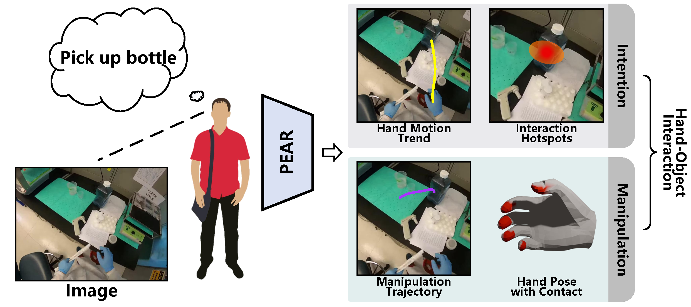

# PEAR: Phrase-based Hand-Object Interaction Anticipation

[](https://creativecommons.org/licenses/by-nc/4.0/)

Official PyTorch implementation of **PEAR: Phrase-based Hand-Object Interaction Anticipation**, published in *Science China Information Sciences (2025)*.

Paper: [https://www.sciengine.com/SCIS/doi/10.1007/s11432-024-4405-4](https://www.sciengine.com/SCIS/doi/10.1007/s11432-024-4405-4)

**Authors**: Zichen Zhang, Hongchen Luo, Wei Zhai, Yang Cao, Yu Kang

---

## 📋 Table of Content
1. [❗ Overview](#1)  
2. [💡 Requirements](#2)  
3. [📖 Dataset](#3)  
4. [✏️ Usage](#4)  
   1. [Environment](#41)  
   2. [Preparation](#42)  
   3. [Evaluation](#43)  
   4. [Train](#44)  
5. [✉️ Statement](#5)  
6. [🔍 Citation](#6)  
7. [🙏 Acknowledgement](#7)

---

## ❗ Overview <a name="1"></a>

PEAR anticipates hand-object interaction processes including both **intention** and **manipulation**.

<p align="center">
    
</p>

---

## 💡 Requirements <a name="2"></a>

Download the following files and place them in the correct paths:

1. `mano_mean_params.npz` from [HaMeR](https://github.com/geopavlakos/hamer) → `models/MANO/_DATA/data/`
2. `MANO_RIGHT.pkl` from [MANO website](https://mano.is.tue.mpg.de/index.html) → `models/MANO/_DATA/data/mano/`
3. [SegFormer B2 backbone](https://pan.baidu.com/s/1u25B3DlL5xZ8NxZe1JGD-A?pwd=ev4m) code: `ev4m` → `weights/segformer_b2_backbone_weights.pth`
4. [PEAR checkpoint](https://pan.baidu.com/s/1UUiUznl9PI96xhMX_sL1Qg?pwd=8246) code: `8246` → `weights/pear_weights.pth`
5. [BLIP weights](https://storage.googleapis.com/sfr-vision-language-research/BLIP/models/model_base.pth) → `models/blip/weights/`
6. [black_points_list.txt](https://pan.baidu.com/s/1XsoZ_Q0P3Adyg_85-eGngg?pwd=zbcz) code: `zbcz` → `models/MANO/_DATA/data/`

---

## 📖 Dataset <a name="3"></a>

The dataset includes:

- Interaction images (from [EGO4D](https://ego4d-data.org/))
- Masks (from [LISA](https://github.com/dvlab-research/LISA))
- Interaction hotspots
- Hand trajectories (pre/post contact)
- Hand pose (on contact frame)
- Hand contact area (.ply)

[Download dataset](https://pan.baidu.com/s/12o8Fn2dqL1HdJgIiRj_u0w?pwd=t5xi) code: `t5xi`  
[Download annotations](https://pan.baidu.com/s/1Kz-GGJeExAQq76sQQw_KfQ?pwd=nn4i) code: `nn4i`

Organize as:

```bash
datasets/
├── images/
├── masks/
├── pose/
├── traj/
├── contact/
├── hotspots/
└── annotation/
```

---

## ✏️ Usage <a name="4"></a>

### Environment <a name="41"></a>

```bash
git clone https://github.com/Derek0907/PEAR_release.git
cd PEAR_release
conda create -n pear python=3.10 -y
conda activate pear
conda install pytorch==2.0.1 torchvision==0.15.2 torchaudio==2.0.2 pytorch-cuda=11.8 -c pytorch -c nvidia
pip install -r requirements.txt
```

### Preparation <a name="42"></a>

Modify the following files with your local paths:

- `cfg/all.yaml`
- `cfg/BLIP.yaml`
- `eval.sh` (set pretrained weights path)

### Evaluation <a name="43"></a>

```bash
bash eval.sh
```

### Train <a name="44"></a>

```bash
bash train.sh
```

---

## ✉️ Statement <a name="5"></a>

This project is for research use only. For any questions or commercial licensing requests, please contact us: [zhangzichen@mail.ustc.edu.cn](mailto:zhangzichen@mail.ustc.edu.cn)

---

## 🔍 Citation <a name="6"></a>

If you find this repository useful, please consider citing our paper:

```bibtex
@article{zhang2025pear,
  title   = {PEAR: phrase-based hand-object interaction anticipation},
  author  = {Zhang, Zichen and Luo, Hongchen and Zhai, Wei and others},
  journal = {Science China Information Sciences},
  volume  = {68},
  number  = {150209},
  year    = {2025},
  doi     = {10.1007/s11432-024-4405-4}
}
```

---

## 🙏 Acknowledgement <a name="7"></a>

This project benefits a lot from the following excellent works. We sincerely thank the authors for their open-source contributions:

- [HaMeR](https://github.com/geopavlakos/hamer)
- [LISA](https://github.com/dvlab-research/LISA)
- [HOI-Forecast](https://github.com/stevenlsw/hoi-forecast)
- [BLIP](https://github.com/salesforce/BLIP)
- [DEQFusion](https://github.com/jinhong-ni/DEQFusion)
